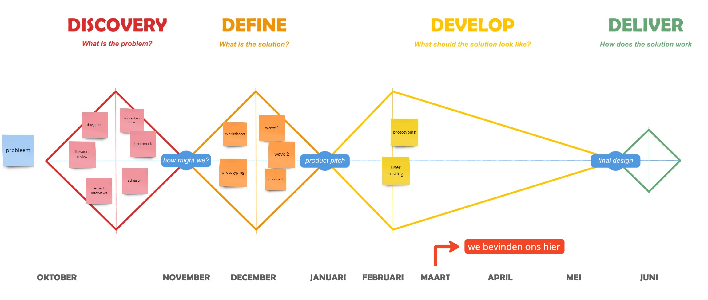

# CYR
_Een interactief muziekspel voor mensen met de ziekte van Parkinson om hun cognitieve -en motorische vaardigheden te verbeteren._

*Projectteam: Aldo Mauro Van Hese; Rösh-Matthew Gryson*

_11/03/2025_


## Samenvatting 

De ziekte van Parkinson is een neurologische aandoening waarvoor tot op heden nog steeds geen remedie voor bestaat. Uit literatuuronderzoek[^1] blijkt dat de verdere ontwikkeling van de aandoening een ernstige invloed heeft op de motorische vaardigheden van de persoon. Intensieve medicatie is nodig om het proces te vertragen, maar dit biedt geen permanente oplossing. Hierbij is er verder uitgediept in de Ronnie Gardiner Methode, een wetenschappelijk onderbouwde methode om cognitieve en motorische vaardigheden te stimuleren via multisensorische prikkels op basis van muziek. 

Om te voorkomen dat deze ziekte verder ontwikkeld, werd **CYR** ontworpen. **C**reate **Y**our **R**ithm is een interactief muziekspel dat helpt bij het verbeteren van de motorische -en de cognitieve vaardigheden. Deze oplossing biedt de mogelijkheid om zelfstandig muziek te maken met behulp van twee geïntegreerde modules: een **touchbox**  en een **boombox**. De gebruiker wordt opgedragen om het ritme van de afspelende muziek na te bootsen, wat een leuke maar ook uitdagende challenge vormt!

> [!NOTE]
> Linken naar protocollen, rapporteringen en diepgaand onderzoek zijn te vinden in de sectie [Bijlagen](#Bijlagen)

## Introductie 

De ziekte van Parkinson is een aandoening die het vaakst voorkomt bij mensen rond 50-60 jaar. Afhankelijk van persoon tot persoon is de ontwikkelingssnelheid van de ziekte in de hersenen verschillend. Naast het innemen van medicatie staat de familie ook in voor de zorg, al is dit vaak niet evident. Naarmate de ziekte vordert, wordt het voor de familie steeds moeilijker om de benodigde zorg te bieden, waarvoor uiteindelijk wordt gekozen voor een geschikte zorginstelling om de intensieve zorg over te nemen.

Het doel van dit project is om mensen met een _vroege_ diagnose van Parkinson te begeleiden, zodanig dat de ziekte niet verergerd. De bewuste keuze om niet verder te gaan met mensen met een langere diagnose ligt aan het feit dat interactie met dagdagelijkse gebruiksvoorwerpen voor hen ingewikkelder worden. **CYR** heeft als doel om de gebruiker multisensorisch te prikkelen zodat hun cognitieve vaardigheden niet verloren gaan. De nadruk op het ontwerp ligt op het zelfstandig gebruiken van het product om de effectiviteit van de werking te garanderen. Het bestaat uit twee geïntegreerde onderdelen: een touchbox waarop muziek wordt gecreëerd en een boombox waar de gebruiker een keuze kan maken uit verschillende sets van voorgeprogrammeerde liedjes. Het ontwerp kan ook gebruikt worden in verschillende omgevingen.

We streven naar een gebruiksvriendelijk product die de gebruiker uitdaagt, maar alsnog het plezier behoudt. 

## Methodologie

Er werd in dit project gewerkt rond het 'Triple Diamond' model. Dit model bestaat uit 3 grote fasen: discover, define en develop. Het eerste semester omslaat de eerste 2 fasen. 

**Discover: |** 
Binnen de discover fase, eerste helft van het semester (week 1-6), werd individueel onderzoek gehouden van mogelijke concepten voor een vooraf gekozen doelgroep. Dit onderzoek bestond uit een literatuurstudie en het afnemen van enkele interviews. Aan het eind van deze fase werden korte pitches gehouden om de huidige concepten te introduceren. Slechts een deel hiervan kon verder bouwen op het concept. 

**Define: |** 
De define fase vond pas plaats in de tweede helft van het eerste semester (week 6-12). Na de pitches en de gekozen concepten werden teams van 2 personen samengesteld om het gekozen concept verder te zetten. Zoals de figuur van de triple diamond het laat zien, is het de bedoeling dat de concepten en oplossingen convergeren tot één werkend concept die de tweede diamond omsluit. Deze definition fase D2 werd opgesplitst in 2 waves. In elk van deze waves werden prototypes gebouwd om het concept nog meer te definiëren en bepaalde fouten in het ontwerp op te sporen. De kern van deze opdrachten was het afnemen van gebruikstests om het prototype te veranderen in functie van hun voorkeuren. 

**Develop: |**
Bij aanvang van het tweede semester (week 13) treden we de derde en laatste diamond binnen. Dit volledige tweede semester zal er gefocust worden op de develop fase. Deze fase wordt opgesplitst in 3 grote deelopdrachten elk met een bepaald doel te bereiken. De eerste deelopdracht heeft als doel om de fysieke, cognitieve en sensoriële ergonomie van het product te optimaliseren aan de hand van theorie, prototyping en testing. De gebouwde prototypes in wave 2 van semester 1 zullen verder verfijnd worden a.d.h.v. meerdere iteraties op beide componenten van het concept. De gebruiker zal opnieuw een keuze maken uit de verschillende iteraties waarop deze worden vastgezet tot het eind van het semester.

<p align="left">
   

## Discovery

### Doestellingen
De keuze om te werken rond mensen met Parkinson maakte het noodzakelijk om voldoende met gebruikers in contact te staan bij het maken van bepaalde ontwerpkeuzes. Het grootste doel is om een product te ontwerpen dat een positieve, stimulerende invloed heeft op de gebruikers. Deze positieve invloeden zouden zowel wetenschappelijk een voordeel moeten bieden als een positieve invloed op het humeur en gedrag van de gebruiker. 

### Materiaal & methoden
Door een grondige verkenning van de onderzoeksopdracht, gebaseerd op een uitgebreide literatuurstudie en diepgaande expertinterviews, werd de verdere onderzoeksrichting zorgvuldig bepaald. Parallel aan de uitvoering van het onderzoek ontstonden de eerste conceptuele ideeën, waarbij inzichten uit de analyse direct bijdroegen aan de ontwikkeling van innovatieve oplossingsrichtingen.

#### Expert interviews (N=3)
De expert interviews werden uitgevoerd om _early_ feedback van de gebruikers te verzamelen die hielpen bij het bedenken van concepten. Uit de interviews kwam vooral naar voren dat de respondenten erkenden dat er een behoefte en marktruimte bestaat voor een nieuw product. Het zou een handig hulpmiddel zijn voor mensen met Parkinson, waarbij er minder extra medicatie moet genomen worden. 

Op basis van de interviews worden hier de belangrijkste zaken aangehaald.

| **Naam**               | **Relatie tot patiënt** | **Belangrijkste inzichten**                                                                                                                                                                                                                                                        | **Opmerkingen over muziek en RGM**                                                                                                                                                                              |
|-------------------------|-------------------------|------------------------------------------------------------------------------------------------------------------------------------------------------------------------------------------------------------------------------------------------|--------------------------------------------------------------------------------------------------------------------------------------------------------------------------|
| **Gaston Vermeulen**    | Patiënt (68 jaar)      | - Parkinson sinds zijn 45ste.<br>- Kan nog stappen, maar fijne motoriek is moeilijk<br>- Heeft moeten stoppen met muziek spelen (saxofoon, fluiten), wat hij pijnlijk vond<br>- Open voor nieuwe producten, vooral met muzikale en ritmische aspecten                                  | - Interesse in ritme/melodie-gebaseerde producten<br>- Voelt zich ongemakkelijk bij groepsactiviteiten<br>- Vond het voorgesteld concept leuk, ziet uitdaging als motivatie                                       |
| **Monique Deurinck**    | Partner van patiënt    | - Mantelzorger van echtgenoot Marcel (10 jaar Parkinson)<br>- Marcel kan niet meer zelfstandig bewegen, woont in een woonzorgcentrum<br>- Merkte de symptomen op in fijne motoriek<br>- Medicatie wisselde vaak, niet altijd effectief                                                | - Marcel vindt zingen in de woonzorgactiviteiten plezierig, minder schaamte in de sociale setting<br>- Skeptisch over effectiviteit van een product, maar ziet potentieel in motivatie en muziek              |
| **Annabelle Vermeulen** | Zus van patiënt        | - Mantelzorger van Gaston (23 jaar Parkinson)<br>- Helpt met dagelijkse taken, voelt emotionele impact van zijn achteruitgang<br>- Gaston heeft mentale en fysieke moeilijkheden, confronterend voor beiden<br>- Positief over nieuwe oplossingen                                   | - Gaston heeft muzikale achtergrond, voelt geluk bij het spelen van muziek<br>- Gelooft dat muzikale en fysieke acties effectief kunnen zijn, vooral met een motiverende insteek                         |

#### Literatuuronderzoek (N=10)
Literatuuronderzoek uitvoeren is cruciaal om goed geïnformeerd te zijn wanneer je werkt rond een doelgroep met een bepaalde aandoening of ziekte. Via een internet research werd tal van relevante informatie gevonden die het project verder kon helpen bij het opstellen van een goede onderzoeksvraag. De literatuurstudie wees uit dat muziek het meest prominente focuspunt vormt voor verdere ontwikkeling binnen dit onderzoek. Het is bewezen dat muziek en ritme een positieve invloed hebben op mensen met Parkinson.

#### Conceptselectie
De concepten die uit het vooronderzoek kwamen, waren allemaal gericht op muziek. De keuze om met **CYR** verder te gaan, was vanzelfsprekend. Dit concept sluit het beste aan bij het verlopen onderzoek. In de andere concepten stond muziek meer centraal. De kern bij **CYR** ligt vooral bij ritme en timing die een oplossing zou moeten geven voor ons project.
<p align="left">
   

## Definition

### Doelstellingen
Vanuit het vooropgestelde onderzoek bouwden we een prototype die het ritme van muziek kon construeren op een gekozen set van liedjes. Vanuit de eerste wave werd het prototype aangepast aan de voorkeur van de gebruiker. Uit deze feedback werden de volgende stappen genomen voor wave 2.

### Materiaal & methoden
De gebruikstesten zullen plaats vinden in 2 waves. De eerste wave legt de focus op de interactie tussen het prototype (zowel touchbox als boombox) en de gebruiker. Hierbij was de bedoeling om enige ongemakken tijdens het gebruik op te sporen en de interactie zo goed mogelijk te optimaliseren. Er werd getest met drukknoppen (verschillende groottes) en hendels waarvan de functies later worden besproken. Wat getest zal worden in wave 2 is afhankelijk van de feedback uit wave 1. Voor het prototypen werd er gebruik gemaakt van mdf, karton, metalen plaatjes en Makey Makey. 

Er zijn twee prototypes van de boombox in verschillende formaten gemaakt om de voorkeuren weer te geven die in elk van de waves naar voren kwamen. De boombox heeft als doel om een liedje te selecteren en biedt de keuze om dit met of zonder percussie te doen via een keuzehendel of aan-/uitknop. Het grotere prototype kreeg aan de zijkant de hendel, het kleinere prototype de knop. Deze keuze was onbewust en kon uiteraard aangepast worden indien nodig. Op beide boomboxen werden grote knoppen gemonteerd die de keuze liet geven uit een aantal liedjes. 

Vooraf aan de bouw van het touchbox werden de dimensies zodanig gekozen dat er genoeg plaats voor de elektronica en de plaatjes die moeten bevestigd worden. In totaal werden 9 gelijke metalen plaatjes gemonteerd, 3 plaatjes per 3 rijen. In het verdere verloop van dit project zou kunnen gewerkt worden met minder of meer plaatjes, deze keuze kan nog verandert worden in de loop van de tijd. 

_Foto 1: Touchbox_;
_Foto 2: Kleine Boombox_;
_Foto 3: Grote Boombox_

<p align="left">
  
  
  

In wave 1 werden de verschillende toetsen van de touchbox aangeduid met hun bijhorende naam. Door de vele verwarring en beperkte kennis over een drumstel werd er overgeschakeld naar een alternatief met icoontjes in wave 2. Door het gebruik van icoontjes op de toetsen kreeg de gebruiker meer voeling om het ritme goed na te bootsen.

<p align="left">
  
  

#### Inspiratie
Het idee om een muziekspel te maken stamde af op het idee dat leek op Guitar Hero, een spel waarbij de gebruiker wordt opgedragen om te tikken op de volgorde van toetsen die worden gegeven. Wanneer de speler op een verkeerde toets drukte, of deze te laat indrukte heeft de speler verloren en moet deze proberen het level opnieuw te spelen. 

In wave 2 werd een spel geprogrammeerd waarin **CYR** op een vergelijkbare manier functioneert. De gebruiker krijgt aan het begin van een liedje een opeenvolging van voorgeprogrameerde "pictogrammen" te zien op het scherm van de boombox die corresponderen met de icoontjes op de touchbox. In dit geval werd er gebruik gemaakt van een Ipad als scherm.

Het doel is om op het juiste moment deze toetsen in te drukken die vervolgens mooi aansluiten op het ritme van de afspelende muziek. Wanneer de gebruiker een foute toets indrukt of te laat indrukt wordt er niet opnieuw gestart, maar wordt er simpel weg aangegeven dat de handeling niet correct werd uitgevoerd. Om op deze manier een spel te creëren dat de uitdaging blijft behouden met de gebruiker, slaagt **CYR** erin om zowel cognitie als motoriek te blijven trainen.

<p align="left">
  
  
  

[](https://youtu.be/sCeQrx-kPlM)

  
#### Makey Makey
Het afspelen van geluid na indrukken van de toetsen wordt mogelijk gemaakt door [Makey Makey](https://makeymakey.com/). 

<p align="left">
  
  

Om muziek te imiteren wordt gekozen om verder te werken op drumpercussie. Elk van de toetsen wordt gelinkt met een andere component van een drumstel. De hendel of aan-/uitknop die eerder werd aangehaald, geeft de mogelijkheid om de percussie van het afspelende lied aan of uit te zetten. Dit kan voor de gebruiker een grotere uitdaging vormen. Om de touchbox te kunnen gebruiken werd voor het uitvoeren van de test gevraagd aan de gebruiker om een polsbandje om te doen zodat er directe verbinding is met de Makey Makey, die op zijn beurt is verbonden met een laptop. 

> [!IMPORTANT]
> Makey Makey maakt gebruik van haptic touch waardoor een simpele aanraking met één van de toetsen al een geluid creëert. 

### Resultaten
In wave 1 kreeg het concept positieve feedback. Gebruikers vonden het een leuk en uitdagend product, zeker voor mensen zonder ervaring met muziekspelen. Ze waardeerden de interactie met de touchbox en vonden het prettig dat ze geen knoppen hoefden in te drukken - het aanraken van de plaatjes was voldoende om feedback te krijgen. Voor mensen met Parkinson kon dit een uitdaging zijn, maar één die te overwinnen was. Een verbeterpunt was de lichte vertraging tussen het aanraken van het plaatje en het afspelen van het geluid.

Het grootste resultaat uit wave 2 was de goede ervaring met het gemaakte spel. De gebruikers vertelden dat het een leuke uitdaging was waarbij ze een duidelijke verbetering merkten bij het meermaals spelen van het spel. De moeilijkheid werd door elke gebruiker anders ervaren, dit is dan ook een persoonlijke kwestie van muziekvaardigheden. Dit is iets wat verwacht werd bij het starten van deze wave en niet als probleem werd gezien omdat het plan was om dit spel in verschillende moeilijkheden/niveaus te maken. 

Gebruikers hadden wel kritiek op de kwaliteit van het spel. De icoontjes waren niet altijd perfect getimed en vielen soms buiten het ritme. Dit kwam door de beperkingen van ProtoPie, waardoor het lastig was om de beweging van de icoontjes nauwkeurig te programmeren.

> [!NOTE]
> De gebruikstests werden uitgevoerd volgens de **Wizard of Oz** methode. _"De Wizard of Oz methode is een gemodereerde onderzoeksmethode waarbij een gebruiker interageert met een interface die autonoom lijkt te zijn, maar (geheel of gedeeltelijk) bestuurd wordt door een mens."_[^2]


#### Enkele foto's met de gebruikers
<p align="left">
  
  

### Conclusies & implicaties
Op basis van de resultaten tijdens de discovery fase en uit de definition fase kunnen we een lijst opstellen met de belangrijkste punten in het (voor)onderzoek:

#### Prototypes
- Een spel op basis van muziek zou de motivatie verhogen om hun conditie beter te onderhouden.
- De groottes van beide boomboxen en de touchbox zijn optimaal alsook voor de groottes van de toetsen.
- De vorm van drukknoppen op de touchbox zijn optimaal en groot genoeg van dimensies.
- Een extra uitdaging zoals meerdere spelvormen zouden het plezier nog meer naar boven halen.
- De delay op het indrukken van de toetsen was een vaak voorkomende storende factor.
- Aanduiding op de toetsen welk geluid welke toets maakte, zorgde voor een beter begrip.
- Het ritme kon iets beter nagevolgd worden m.b.v. de Ipad die werd gemonteerd aan de boombox.
- De toetsen, verbonden met Makey Makey, waren tè responsief. M.a.w. als de toets voor langere tijd werd ingedrukt, kreeg je een rare vervorming van het geluid.

#### Gebruikers
- Er was vaak een gebrek aan kennis over de verschillende componenten (van een drumstel).
- In een aantal gevallen waren de gebruikers niet compatibel voor het gebruik van het prototype door bepaalde menselijke factoren (verbinding i.v.m. Makey Makey).
- Het duurde een aantal keren voordat er werd onthouden welke toets welk geluid maakte.
- De gebruikers lieten een goed gevoel achter na afronden van de tests.
- Gebruikers met duidelijkere symptomen (vb. tremor hand) hadden meer moeite om op een toets te drukken.

> [!IMPORTANT]
> Design requirements
>  - 1.1 De touchbox bevat een minimale hoogte om elektronica te bewaren
>  - 2.1 De touchbox produceert geluid door een enkele aanraking met één van de toetsen
>  - 2.2 De toetsen zijn groot genoeg om eenvoudig en comfortabel deze aan te tikken
>  - 2.3 Elke toets wordt afgebeeld met een ander symbool
>  - 3.1 De noombox bevat een minimale grootte voor het ondersteunen van een scherm 
>  - 3.2 De noombox heeft een functieknop aan de zijkant om het ritme van muziek aan/uit te schakelen
>  - 3.3 De boombox bevat verschillende knoppen om een keuze te maken uit verschillende liedjes
>  - 4.1 De toetsen bevinden zich in een dicht gestapeld raster (2x2, 3x2, 3x3) om multi-touch mogelijk te maken

## Bill of materials

- Natuurhout (vooral duurzaam, maar kwaliteitsvol hout)
- Roestvrij staal
- Arduino
- Kunststof drukknoppen/toetsen
- Digitale interfaces

## Kritische reflectie
Bij aanvang van dit project werd er veel progressie gemaakt. Na de vorming van de groepen werd er overlegd wat er goed was en wat er nog kon verbeterd worden aan het concept met de feedback gekregen uit de pitch. Hierna werd er gebrainstormd over wat er zou kunnen worden getest voor de verschillende waves. Een overgang werd gemaakt tot de prototyping fase, dit werd misschien wel wat te snel gedaan en had als gevolg dat er tijdens de tests af en toe iets onverwachts plaatsvond. Dit waren dingen zoals Protopie dat een update nodig had, een verbinding van de Makey Makey die loskwam etc. Desondanks bracht dit de positieve resultaten uit de tests niet neer. 

Waar er vooral last werd ervaren, was het contacteren van gebruikers om de waves mee uit te voeren. Door de moeilijke doelgroep was er geen optie waar alle tests op een gelijk tijdstip zou kunnen worden uitgevoerd. De gekozen doelgroep heeft nog geen extreme zorg nodig en is niet altijd even mobiel. De meeste gebruikers hadden liever een afspraak moment bij hen thuis, wat soms voor moeilijkheden zorgde. 

Wave 1 werd initieel afzonderlijk uitgevoerd, maar een grondigere voorafgaande analyse had wenselijk geweest alvorens de momenten definitief vast te leggen.
Naar aanleiding van de eerste test binnen wave 1 werd besloten om de daaropvolgende waves simultaan af te nemen. Er werd met een tiental mensen in contact gestaan, maar door een aantal factoren kon er geen gepast moment ingepland worden om het prototype te testen. Dit had als gevolg dat er een test werd uitgevoerd met een persoon die geen Parkinson heeft, maar wel vaak in contact heeft gestaan met de doelgroep en nuttige feedback heeft kunnen geven.

Deze korte tegenslagen terzijde, verliep de samenwerking en de vooruitgang die werd gemaakt in het proces goed. Na het voltooien van de waves kan het project naar de volgende fase. De waves hebben een grote impact gehad op het project en hebben de nodige motivatie gegeven om verder te werken aan het project. De gebruikers gaven ook aan nog in contact te willen staan, wegens de grootte interesse in het concept. In de toekomst zullen deze mensen de mogelijkheid krijgen om als eersten het volmaakt prototype te testen.

## Develop 1 (N=3)

### Doelstellingen
De oplossingen die werden gebracht in wave 2 van de definition fase, zullen verder verfijnd worden waarbij opnieuw een aantal gebruikstests worden afgelegd. Het doel is om de centrale interfaces van beide componenten vast te leggen met een aantal gebouwde iteraties.

### Materiaal & methoden
Om de interfaces van de touchbox en de boombox vast te leggen, werden een aantal iteraties gebouwd:
- De touchbox bevat variaties met 4, 6, en 9 (origineel) toetsen
- De boombox bestaat uit 4 mogelijke varianten: 4 kleinere knoppen met extra respons, 2 kleinere knoppen, een draaiknop en een draaiwiel
  
**Touchbox**

Verschillende iteraties van de touchbox werden gemaakt met een verminderd aantal toetsen. Het origineel bevatte teveel knoppen waardoor een groot aantal niet werden gebruikt tijdens een gebruikstest. Deze bevinding stamde af van de definition fase. Ook is het moeilijk om aan elke knop een ander icoon aan te linken aangezien dat een drumstel soms overlappende elementen bevat. 

> _"Hoe meer knoppen hoe verwarrender"_

**Boombox**

De verschillende iteraties op de boombox bevatten interfaces die elk op een andere manier worden gebruikt.


**1.** Het originele prototype dat 4 keuzeknoppen bevatte voor het selecteren van een liedje, werd opnieuw gebouwd met een viertal kleinere knoppen waarbij een extra respons wordt toegepast na indrukken van een knop. 

**2.** De interface met 2 knoppen dient op gelijkaardige wijze gebruikt te worden. De interface bestaat uit een lijst van liedjes die voorgeprogrammeerd zijn en bevat ook de optie om eigen liedjes up te loaden binnen de software.

> _"Na mum van tijd zul je die liedjes zat zijn"_

De linkerknop zorgt voor het "scrollen" van de lijst naar onder, de rechterknop zorgt voor de navigatie naar boven. Om een keuze te maken uit een liedje worden simultaan beide knoppen ingedrukt. 

**3.** De draaiknop heeft als mogelijkheid om opnieuw uit een lijst van liedjes te scrollen via een draaibeweging naar links of naar rechts. Om een liedje te selecteren wordt dan op de knop gedrukt. Na het uitvoeren van de gebruikstests kan geconcludeerd worden dat deze interface het meest gunstige is binnen de 4 mogelijkheden.

**4.** Het draaiwiel bevat een andere manier voor het selecteren van een liedje. Het draaiwiel is via een intern draaiwiel verbonden. Wanneer er met het draaiwiel gedraaid wordt, dan zal de interne schijf ook meedraaien volgens de beweging van het draaiwiel. Binnen de mogelijkheden eindigde deze interface op de tweede plaats.

Hierbij een [link](https://ugentbe-my.sharepoint.com/:w:/g/personal/rosh_gryson_ugent_be/EX9zUukzIiRMriMEYqTozIYBu-ja_H_BCRZ7edhv2Yo20w?e=A8jbA5) naar de verschillende gebouwde iteraties.

> [!IMPORTANT]
> Verdere ontwerpkeuzes worden aangekaart in [Protocol develop 1](https://ugentbe-my.sharepoint.com/:w:/g/personal/rosh_gryson_ugent_be/EVEtEksqdJJBhZXit1Fg1yQBjQquEJI503QhC8J9cvlPyg?e=adsysK)

### Resultaten

De volgende resultaten komen rechtstreeks van het rapport en zullen hier kort toegelicht worden.

- #### **Touchbox MOS Test**

  |**Gebruiker**               | **Score** | **Beperking**|
  |-|-|-|
  | Anne Mestdag    | 3      | Licht Storend   | 
  | Sofie Vanhoutte    | 2    | Storend|
  | Pieter Jan Lernout | 4 | Waarneembaar, maar niet storend  |
  | | *Gem.: 3* ||
  
  De testpersonen ervaarden de latency op de touchbox gemiddeld gezien nog als licht storend.

- #### **Varianten Touchbox** 
  *1 - meest voorkeur*
  
  *3 - minst voorkeur*
  |       | **9 toetsen** | **6 toetsen**| **4 toetsen** |
  |-|-|-|-|
  | Anne Mestdag    | 2      | 1   | 3|
  | Sofie Vanhoutte    | 2    | 1 | 3|
  | Pieter Jan Lernout | 3 | 1  |  2|
  | || *Favoriet* 

- #### **Varianten Boombox** 
  *1 - meest voorkeur*
  
  *4 - minst voorkeur*
  |       | **Draaiknop** | **2 drukknoppen**| **4 drukknoppen** | **Draaiwiel**|
  |-|-|-|-|-|
  | Anne Mestdag    | 1      | 2| 4   | 3|
  | Sofie Vanhoutte    | 2  |4  | 3 | 1|
  | Pieter Jan Lernout |1| 3 | 4  |  2|
  | | *Favoriet* 

- #### **Meningen Hendel**
  De hendel werd doorgaans opgemerkt met een iets negatievere indruk wanneer ernaar werd gevraagd. De locatie was volgens hen te verschuild en het uitsteken van de hendel vormde een miniem probleem

- #### **Voordelen en nadelen verbinding touch- en boombox**
  |**Voordelen**|**Nadelen**|
  |-|-|
  |"Zo lijkt het wat logischer, het product voelt meer aan als 1 geheel"| "Het is mogelijks moeilijker om op te bergen" |
  |"Voelt ergonomischer aan (scherm zit automatisch op een goede positie)"| "Aangezien het 1 geheel is, is het zwaarder"|
  |"Verbinding tussen elektronica zal eenvoudiger zijn"||

### Conclusies en implicaties
- Er kan gesteld worden dat de latency op de touchbox nog een probleem is, merendeel van de gebruikers merkt dit nog op en stoort zich er aan. Het veranderen van de software van Scratch naar ProtoPie voldoet niet. Een mogelijke stap naar andere hardware is een oplossing.
- Wanneer de gebruikers de verschillende iteraties op de touchbox lieten zien, werd er 1 ontwerp duidelijk vooropgesteld. Dit is het ontwerp met 6 toetsen. Hierbij lieten we hun ook nadenken over de hoeveelheid knoppen men dan nog tot hun beschikking zouden hebben. De eerste keus bleef behouden, dit betekent dat meer dan 6 knoppen voor de gebruiker al overbodig lijkt.
- Wanneer op dezelfde wijze de varianten op de interface van de boombox werden voorgelegd, was er een duidelijke voorkeur voor de variant met de draaiknop. De draaiknop leek de goede oplossing voor dit probleem. Het integreren van het selecteren van de liedjes in de software leek voor alle gebruikers efficiënter om zo te kunnen selecteren via 1 knop. 
- De grote van het ontworpen scherm blijkt goed te zijn. Het gaat eerder over de grote van de iconen i.p.v. de grote van het scherm.
- het spel zelf zit goed ineen, er kan mogelijks nog gespeeld worden met het kleurenpalette en een deeltje van de layout.
- De hendel is onnodig. De functie hiervan kan worden geïntegreerd in de gekozen interface.
- De algemene mening van de gebruikers geeft weer dat ze liever de touchbox en boombox aan elkaar zouden hebben. Dit haalt een aantal praktische problemen weg en is de voor de hand liggende keuze.


> [!IMPORTANT]
> Design requirements
>  - 1.2 De touchbox en boombox bevatten snap/klikverbindingen om deze aan/uit elkaar te halen
>  - 1.3 Het product is zo compact mogelijk
>  - 2.4 De interface van de boombox is zodanig ontworpen zodat de interactie hiermee geen overbodige elementen bevat
>  - 2.5 Voor elke gebruiker is er een uitdagend niveau beschikbaar
>  - 2.6 De display is simplistisch en makkelijk om te begrijpen
>  - 3.4 Het product geeft duidelijk aan met welke elementen in interactie gegaan kan worden
>  - 3.5 De producthiërarchie geeft duidelijk weer welke elementen de belangrijkste rol spelen in de interactie met het product
>  - 3.6 De touchbox is responsief en heeft een lage latency
>  - 4.3 De knoppen van de touchbox hebben een gepaste grootte
>  - 4.4 Het indrukken van de knoppen op de touchbox gebeurt aan de hand van capacitive touch
>  - 4.5 De interactie met de boombox gebeurt aan de hand van fysieke knoppen

## Develop 2 (N=4)

### Doelstellingen
Uit deelopdracht 3 werden de interfaces voor zowel de touchbox als boombox vastgelegd. Het doel van deelopdracht 4 (develop 2) is nadruk leggen op de usability en user experience van CYR. 

### Materiaal & methoden
Om een betere user experience te bieden voor de gebruikers, zal de draaiknop voorzien zijn van textuur en tactiele feedback. Een sensorial board wordt gemaakt om de gebruiker een keuze te bieden uit een aantal texturen. Een ander soort bordje wordt opgesteld om de grootte van de draaiknop te bestuderen. Gelijkaardig aan het sensorial board, worden een zestal draaiknoppen met verschillende groottes voorgesteld aan de gebruiker. Hun taak om een voorkeur te kiezen waarop verder gewerkt zal worden in DE volgende deelopdracht. 

_Foto 1: Textuurbord; 
Foto 2: Bord met draaiknoppen van verschillende groottes_
<p align="left">
  
  

> [!IMPORTANT]
> Verdere ontwerpkeuzes worden aangekaart in [Protocol develop 2](https://ugentbe-my.sharepoint.com/:w:/g/personal/rosh_gryson_ugent_be/EU_6rTA0xLNAif_-g8QjNWkBcila4Qp8DFvM6UZk4YTpxg?e=iIEPJe)

#### Hardware switch
Zoals in vorige deelopdrachten wordt vermeld, is het latentieverschil tussen het aanraken van het metalenplaatje en het horen van het geluid nog een te grote kloof voor onze gebruikers. Als poging om de latency te verminderen, zal de Makey Makey nu worden vervangen door Arduino. Er wordt gewerkt met een aantal Arduino componenten:

- Arduino Nano
- 12 Key Capacitive I2C Touch Sensor (MPR121)
- MP3-TF-16P V3.0 (DF player mini)
- Speaker

_Foto 1: Arduino Nano met DF player mini en speaker; 
Foto 2: I2C Touch Sensor met krokodillenklemmen; 
Foto 3: Volledige opstelling_
<p align="left">
  
  
  

Via een breadbord (groot wit bordje) worden de verschillende componenten met _jumper wires_ met elkaar verbonden. De DF player mini bevat een micro SD kaart met een aantal geluiden. De krokodillenklemmen aan de touch sensor zijn verbonden met de metalenplaatjes. De speaker die is verbonden met deze mini player zet de aanraking van één van de toetsen om in geluid. Ook deze touch sensor bevat capacitive touch waardoor een enkele aanraking met de plaatjes al volstaat om geluid te creëren.

Hieronder staat de code die wordt gebruikt om de aanraking om te zetten in geluid:


```c++
#include <Wire.h>
#include <Adafruit_MPR121.h>
#include <SoftwareSerial.h>
#include <DFRobotDFPlayerMini.h>

Adafruit_MPR121 cap = Adafruit_MPR121();

// Let op: DFPlayer TX → pin 11, RX ← pin 10
SoftwareSerial mySerial(10, 11); // RX, TX
DFRobotDFPlayerMini myDFPlayer;
bool dfPlayerOk = false;

uint16_t previousState = 0; // Houdt vorige aanraakstatus bij

void setup() {
    Serial.begin(9600);
    mySerial.begin(9600);

    if (!cap.begin(0x5B)) { // Controleer het I2C-adres (kan ook 0x5A of 0x5C zijn)
        Serial.println("MPR121 niet gevonden!");
        while (1);
    }
    Serial.println("MPR121 gestart 🤖");

    dfPlayerOk = myDFPlayer.begin(mySerial);
    if (!dfPlayerOk) {
        Serial.println("DFPlayer Mini niet gevonden!");
    } else {
        myDFPlayer.volume(25);  // Volume 0–30
        Serial.println("DFPlayer gestart 🤖");
    }
}

void loop() {
    uint16_t currentState = cap.touched(); // Lees de huidige status

    for (uint8_t i = 0; i < 12; i++) {
        bool previousTouch = (previousState & (1 << i));
        bool currentTouch = (currentState & (1 << i));

        if (currentTouch && !previousTouch) { // Alleen een nieuwe aanraking registreren als de toets nu wordt aangeraakt maar eerder niet
            if (isMetalTouched()) {
                Serial.print("TOUCH_");
                Serial.println(i);

                if (dfPlayerOk) {
                    myDFPlayer.play(i + 1);  // Speel bestand 0001.mp3 t/m 0012.mp3
                } else {
                    Serial.println("DFPlayer niet actief, geen geluid afgespeeld.");
                }
            }
        }
    }

    previousState = currentState; // Update vorige status
    //delay(100); // Optioneel: afvlakken van input
}

bool isMetalTouched() {
    delay(5);  // Stabilisatie
    uint16_t secondCheck = cap.touched();
    return secondCheck != 0;
}
```

Om te voldoen aan design requirement 1.3,
> Het product is zo compact mogelijk 
Ondergaat de boombox opnieuw een vormvariant. Bij deze variant wordt de boombox rechtstreeks verbonden met de touchbox waardoor deze wordt opgeborgen als één grote "doos". 


### Resultaten

...

### Conclusies en implicaties

...

### Design requirements

| ID | Design requirement | Source | Date |
| ------------- | ------------- | ------------- | ------------- |
| **D1**  | **Algemeen** |  |  |
| D1.1 | De touchbox bevat een minimale hoogte om elektronica te bewaren. | Discovery | 14/11/2024 |
| D1.2 | De touchbox en boombox bevatten snap/klikverbindingen om deze aan/uit elkaar te halen. | Definition | 18/02/2025 |
| D1.3 | Het product is zo compact mogelijk. | Definition | 18/02/2025 |
| **D2**  | **Gebruiksgemak** |  |  |
| D2.1 | De touchbox produceert geluid door een enkele aanraking met één van de toetsen. | Wave 2 | 14/11/2024 |
| D2.2 | De toetsen zijn groot genoeg om eenvoudig en comfortabel deze aan te tikken. | Wave 1 | 26/11/2024 |
| D2.3 | Elke toets wordt afgebeeld met een ander symbool. | Wave 2 | 5/12/2024 |
| D2.4 | De boomboxinterface is ontworpen zonder overbodige elementen, zodat de interactie eenvoudig blijft. | Definition | 18/02/2025 |
| D2.5 | Voor elke gebruiker is een uitdagend niveau beschikbaar. | Definition | 18/02/2025 |
| **D3** | **Interactiviteit** |  |  |
| D3.1 | De Boombox bevat een minimale grootte voor het ondersteunen van een scherm. | Wave 2 | 5/12/2025 |
| D3.2 | De Boombox heeft een functieknop aan de zijkant om het ritme van muziek aan/uit te schakelen. | Discovery | 24/10/2024 |
| D3.3 | De Boombox bevat verschillende knoppen om een keuze te maken uit verschillende liedjes. | Discovery | 24/10/2024 |
| D3.4 | Het product geeft duidelijk aan met welke elementen in interactie gegaan kan worden. | Definition | 18/02/2025 |
| D3.5 | De producthiërarchie geeft duidelijk weer welke elementen de belangrijkste rol spelen in de interactie met het product. | Develop 1 | 18/02/2025 |
| D3.6 | De touchbox is responsief en heeft een lage latency. | Definition | 18/02/2025 |
| **D4** | **Ergonomie** |  |  |
| D4.1 | De draaiknoppen hebben een minimale diameter (4-6cm) om een keuze uit liedjes te maken. | Discovery | 24/10/2024 |
| D4.2 | De toetsen bevinden zich in een dicht gestapeld raster (2x2, 3x2, 3x3) om multi-touch mogelijk te maken. | Discovery | 24/10/2024 |
| D4.3 | De knoppen van de touchbox hebben een gepaste grootte. | Develop 1 | 18/02/2025 |
| D4.4 | Het indrukken van de knoppen op de touchbox gebeurt aan de hand van capacitive touch. | Definition | 18/02/2025 |
| D4.5 | De interactie met de boombox gebeurt aan de hand van fysieke knoppen. | Definition | 18/02/2025 |

## Bijlagen

**D1: Discovery**
- [Protocol interviews](https://ugentbe-my.sharepoint.com/:w:/g/personal/aldo_vanhese_ugent_be/ESJYqHmrCHZLsC0qj__VXJ0BjyDkQe4iN9FXYPPxXNy2uQ?e=tfqRws)
- [Rapport interviews](https://ugentbe-my.sharepoint.com/:w:/g/personal/aldo_vanhese_ugent_be/EYnefagKg3FOtLsMqfEdwcMBIqPX8TSfu_CDAfIlTkcXZQ?e=Ka2ge1)
- [Protocol literatuuronderzoek](https://ugentbe-my.sharepoint.com/:w:/g/personal/aldo_vanhese_ugent_be/EXIrXCpz-dFAuOz6OB77Z0QBnIgQqzJ2xosTrCaE54sqkw?e=Ui9HQr)
- [Rapport literatuuronderzoek](https://ugentbe-my.sharepoint.com/:w:/g/personal/aldo_vanhese_ugent_be/ETgJmnygez1KvILyP5yb4owB2Ubt0oamoWoxb60TCJ8oPQ?e=Qta01t)

**D2: Definition**
- [Protocol gebruikstests](https://ugentbe-my.sharepoint.com/:w:/g/personal/rosh_gryson_ugent_be/EZP574aSoAhFl09WsWrbi8UBA5_1NxcKcqAjORO0SBlqww?e=72MF4B)
- [Rapport gebruikstests](https://ugentbe-my.sharepoint.com/:w:/g/personal/rosh_gryson_ugent_be/EdqZbkmwm4NGiZS6KD74P3EBFJ-uTSXOdE_JABqfQalWkQ?e=12LJiF)
- [Storyboard](https://ugentbe-my.sharepoint.com/:w:/g/personal/aldo_vanhese_ugent_be/EWE_Iul9T3BOiqSTV3mQHsABdU0qXvV47XVcKRbxtR9C3w?e=RbmGrt)

**D3: Develop 1**
- [Protocol develop 1](https://ugentbe-my.sharepoint.com/:w:/g/personal/rosh_gryson_ugent_be/EVEtEksqdJJBhZXit1Fg1yQBjQquEJI503QhC8J9cvlPyg?e=fhjMhS)
- [Rapport develop 1](https://ugentbe-my.sharepoint.com/:w:/g/personal/rosh_gryson_ugent_be/ES3WNbN0WClOn1nJESBFn6IBWB74uhWHl6Zd6KmwXddXkg?e=pNfeQX)

**D4: Develop 2**
- [Protocol develop 2](https://ugentbe-my.sharepoint.com/:w:/g/personal/rosh_gryson_ugent_be/EU_6rTA0xLNAif_-g8QjNWkBcila4Qp8DFvM6UZk4YTpxg?e=hxLTQE)
- [Rapport develop 2](https://ugentbe-my.sharepoint.com/:w:/g/personal/rosh_gryson_ugent_be/ESmI_AUUn49GgIqkPFp2I3wBmfKqKCH67thOzXqvPDNyrQ?e=HhFiGH)

## Bronnen

[^1]: Diedrich, N. (2020, Juli). _The Evolution-Driven Signature of Parkinson's Disease. CellPress._ (https://www.cell.com/trends/neurosciences/fulltext/S0166-2236(20)30103-X)
[^2]: Paul, S. Rosala, M. (2024, April). _The Wizard of Oz Method in UX. Nielsen Norman Group_ (https://www.nngroup.com/articles/wizard-of-oz/)


